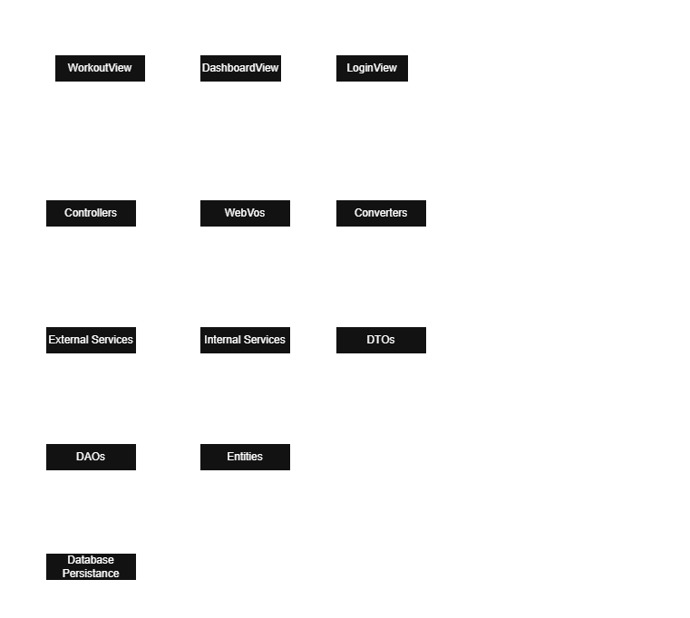

# Project Architecture Overview

This repository implements a modular N-tier architecture and follows the MVC (Model-View-Controller) paradigm, primarily for a Java backend and a TypeScript/SCSS/HTML frontend which is a separate repository: https://github.com/jtucke3/workout-client

---

## Overall Architectural Diagram

---

### Layer 0: Frontend (Client)
The user-facing interface built with Angular, SCSS, and HTML.

**Components:**
- `WorkoutView`, `DashboardView`, `LoginView` (Angular components)

**Responsibility:**
- Collect user input and display backend responses  
- Communicate with the backend via HTTP requests  
- Never contains business logic or data validation

---

### Layer 1: Presentation Layer (Controllers + WebVos + Web Converters)
The API boundary between frontend and backend.

**Components:**
- `controller/`: REST API endpoints (e.g., `UserController`, `WorkoutController`)
- `webVo/`: Web View Objects (contracts for frontend-backend communication)
- `converter/`: Web converters for mapping WebVo <-> DTO

**Responsibility:**
- Receive and respond to HTTP requests  
- Accept only WebVo objects; no business logic inside controllers  
- Use converters to transform WebVo -> DTO  
- Return WebVo responses built from DTOs  
- Communicate directly with the Service layer

**Note:**  
Some converter implementations currently include DTO <-> Entity logic and are used by internal services. These may be reorganized into dedicated domain converters in Layer 2 for clearer separation of concerns as the project evolves.

---

### Layer 2: Business Logic Layer (Services + DTOs + Domain Converters)
The core of backend logic and orchestration.

**Components:**
- `service/`: Internal and external service implementations (e.g., `UserService`, `WorkoutService`)
- `dto/`: Data Transfer Objects (validated, structured data)
- `converter/`: Domain converters for mapping DTO <-> Entity

**Responsibility:**
- Validate and process incoming DTOs  
- Execute business rules and orchestrate workflows  
- Use domain converters to build or update entities  
- Call DAOs for persistence  
- Return DTOs to controllers (never expose entities or WebVos)

---

### Layer 3: Data Access Layer (DAOs + Entities)
Handles persistence and database interaction.

**Components:**
- `dao/`: Data Access Objects (e.g., `UserDao`, `WorkoutDao`)
- `domain/`: Entity classes mapped to SQL tables (e.g., `UserEntity`, `WorkoutEntity`)

**Responsibility:**
- Perform CRUD operations against the SQL database  
- Use entities for persistence logic  
- Return entities to services for transformation into DTOs  
- Never expose entities to controllers

---

### Layer 4: SQL Database
The raw data store.

**Components:**
- PostgreSQL, MySQL, or other RDBMS  
- Tables mapped to entity classes

**Responsibility:**
- Store and retrieve persistent data  
- Accessed only via DAOs  
- Never directly accessed by services or controllers

---

## Mapping Components to Layers (per Diagram)

| Layer       | Components                                                                                                         |
|-------------|--------------------------------------------------------------------------------------------------------------------|
| Layer 0     | Angular views (WorkoutView, DashboardView, LoginView)                                                              |
| Layer 1     | controller/, webVo/, converter/ (WebVo <-> DTO)                                                                    |
| Layer 2     | service/, dto/, converter/ (DTO <-> Entity)                                                                        |
| Layer 3     | dao/, domain/                                                                                                      |
| Layer 4     | SQL database                                                                                                       |

---

## Definitions

- **Controller:** Entry point for HTTP requests; receives WebVo; uses Web Converter; no business logic.
- **Service:** Contains business rules and orchestration; uses Domain Converter; returns DTOs.
- **WebVo:** Raw frontend payload; used only in Layer 1; never trusted until validated.
- **DTO:** Internal data container; used across Layer 1 and 2; bridges presentation and business logic.
- **Entity:** Persistence model; used in Layer 3; may be manipulated transiently in services.
- **DAO:** Interface to the database; performs CRUD using entities.
- **Converter:** Utility class for mapping:
  - WebVo <-> DTO (Layer 1)
  - DTO <-> Entity (Layer 2)

---

## Data and Control Flow

**Example: Registering a new user**
1. **Frontend form** submits `RegisterWebRequestWebVo` -> handled by `LoginController`.
2. **LoginController** uses **AuthConverter** -> builds `RegisterRequestDTO`.
3. **LoginController** passes the DTO to **AuthExternalService** (Layer 2, external boundary).
4. **AuthExternalService** delegates to **AuthInternalService** (Layer 2, core business logic).
5. **AuthInternalService** encodes the password and applies validation/business rules.
6. **AuthInternalService** calls `UserDao.saveNew(...)` -> builds and persists a `UserEntity` (Layer 3).
7. **UserDao** persists the entity into the SQL database (Layer 4).
8. **AuthInternalService** returns a success result (e.g., `UserDTO`).
9. **LoginController** wraps the DTO into a `UserWebVo` -> returns the response to the frontend.

---

*Questions or improvements? Feel free to open an issue or reach out!*